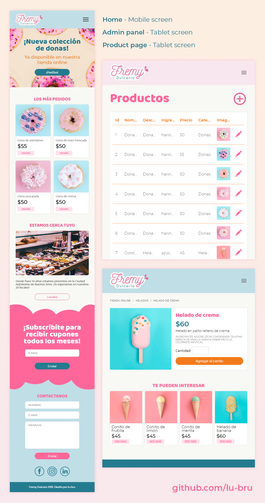

# Fremy
This website was made as the final project during a web development course at [UTN](https://www.frba.utn.edu.ar/). It's an e-commerce simulator for a fictional bakery and candies store. Using Node.js and Handlebars, it queries the databases and outputs dynamic HTML pages.


## Installation

- Start Apache and MySQL.

- Create a new database called fremy_db and import the tables usuarios.sql and productos.sql from the tables folder.

- For the subscription and contact section to work, you'll need to enter a valid e-mail and password in the mail.js and index.js files.

- Lastly, just install the node modules and run.

```
npm install
```


```
npm start
```
Fremy will be available at localhost:3000


## Usage

As a regular user, you can:

- Register a new account
- Login to your created account
- Log out
- Change your name, surname, e-mail and password
- Subscribe and receive a welcoming e-mail
- Send an e-mail to the store

And if you log in as the admin, you can also:

- Access the admin panel
- Add, delete and edit products

To log in as the administrator, just input the following on the log in screen:

E-mail: admin@fremy.com

Password: AdminFremy

## Design preview


